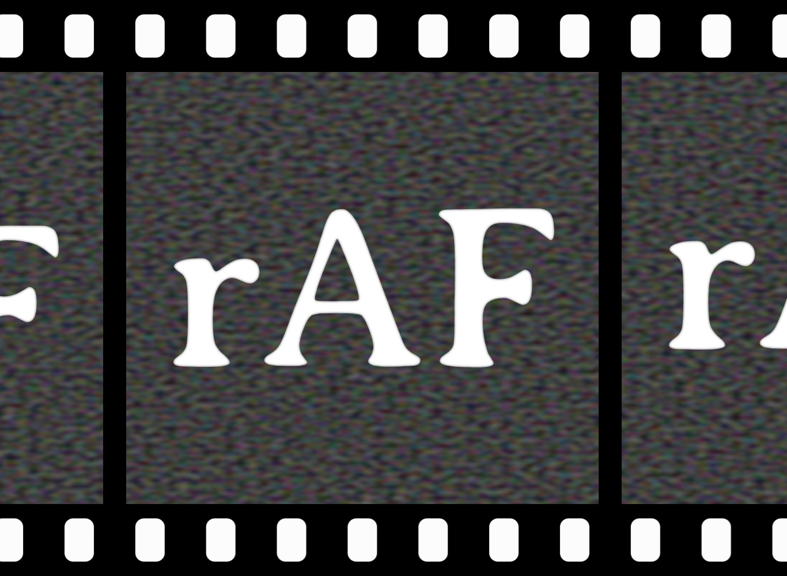

# </img> &emsp;JavaScript Animation Library

## What is it?
The name **rAF** is a common abbreviation for the core JavaScript animation function: `requestAnimationFrame()`. It is a highly flexible animation library for HTMLElements, SVGElements, and CSSStyleRules. It includes 99% of CSS animation functionality, but also extends that functionality greatly.
It is a solo open source project about to be released in its first public version 1.0. Hopefully others will contribute in the future.

## Getting started
If you want to skip the formalities and jump right in, the best place to start are the <a href="https://sidewayss.github.io/rAF/apps/">3 Apps</a> (latest code on GitHub Pages) that test & demonstrate the library and generate starting-point JavaScript code. They are also available in a more stable form on my <a href="https://sidewayss.com/raf/apps/">homepage</a>.

There are also animation examples in these collections on CodePen:

<i>...coming soon along with v1.0</i>

<a href="https://sidewayss.github.io/rAF/docs/raf-by-class.html">Properties and Methods by Class</a> catalogs classes and constants you might want to use. The current state of documentation is skeletal. Hopefully the examples, apps, and app instructions will help to fill to fill things in.

## Setup
**rAF** is modular. There are currently no packages or minified file. Should be coming your way soon after v1.0. For most users, `raf.js` provides all the exports you need. Here is a typical import statement:
```
import {E, Ez, F, P, PFactory, Easy, Easies, AFrame} from "https://sidewayss.com/raf/src/raf.js";
```
You must execute this method prior to using any other rAF features:
```
PFactory.init();
```
It initializes constants that are used internally, many of which you will use too. Among those are the `E`, `Ez`, `F`, and `P` objects listed in the `import` example above.

## Features
**rAF** provides a flexible, structured, and compact way to create and execute CSS or SVG animations of two types:
- Gradual value changes controlled by timing patterns
- Cue-based animations, where timing cues trigger animation events that can span elements and properties
It also provides an alternate paradigm for setting properties/attributes where the property sets the value on the element, not the other way around. There are advantages.

Features CSS doesn't have:
- Multiple timing patterns for a single property, within and across functions
- Eased steps, for timing and values separately
- Max and min limits by argument by element
- Animate the same property differently across elements in a single animation
- <a href="https://github.com/color-js/color.js">Color.js</a> integration
- For two-legged easings:
    - Not just `inOut`, there are `outIn`, `inIn`, and `outOut` settings
    - Adjustable mid point for the value
    - Adjustable split point for time
    - Adjustable gap in time between the two legs
- *and more...*

Goals, Assumptions, and Approach:
- Normalize all things similar across CSS and SVG
- Allow for the animation of every property/attribute and function in full detail
- Create a minimal syntax that is both flexible and forgiving
- Make it fully object-oriented within the confines of JavaScript
- Assume a “modern browser” that supports ES6*
- Build in callbacks for flexibility and the ability to meet as-yet-unknown requirements
- Create a way to test user GPU power and develop methods for handling low-end vs high-end GPUs

\* *The biggest browser compatibility issue for rAF is [private properties](https://developer.mozilla.org/en-US/docs/Web/JavaScript/Reference/Classes/Private_properties), which have [limited support](https://caniuse.com/?search=private%20class) in pre-2021 browser versions. I have considered converting all the `#` to `_`, but the more time that passes, the less it matters. Maybe it's something for a minified/transpiled version.*

## Why bother?
I originally got interested in web animations through animating SVG sheet music scores, created and exported to SVG by <a href="https://musescore.org">MuseScore</a> (github repo <a href="https://github.com/musescore/MuseScore">here</a>, my fork is <a href="https://github.com/sidewayss/MuseScore">here</a>). I then decided to create a heavily animated personal web site. In that process I consolidated a bunch of common animation code and created the initial version of **rAF**.

Soon thereafter I stepped away from programming for the next five years. Upon my return in April, 2023 I started to update my personal site. I soon realized that CSS had evolved notably and that my core design for **rAF** was outdated and not as clean or complete as I had thought. I was considering seeking gainful employment in programming again, and updating **rAF** seemed like a good way to freshen my skills and produce a result that would fill in for the gap in my CV.

I don't expect to see a lot of interest in **rAF**. It's a now-obscure niche, and there have been many animation libraries produced since Velocity.js took the web by storm over a decade ago. I was mostly animating SVG, and Velocity doesn't do SVG gradients, among other things. So I built my own stuff.

These days animated video is much more common online than all but the most basic web animations. Why? More tools for creation and more reliable results. The one advantage that web animations have is interactivity, but how many interactive animations have you seen? *see <a href="https://sidewayss.com">my homepage's interactive greeting</a>*

Running digital video through a codec is a lot more reliable than running a JavaScript animation. Browser differences are minimal. The code is supremely optimized. Loss of resolution due to bandwidth is friendlier than a stuttering or otherwise malfunctioning animation, and users are more familiar with it. They understand what's to blame.

I built this library for personal satisfaction / education, a goofy homepage, and to demonstrate that I can still design and build solid software. I figure there might be a few other people out there who want to do more extreme animations and could find it useful. Maybe some will even want to contribute.